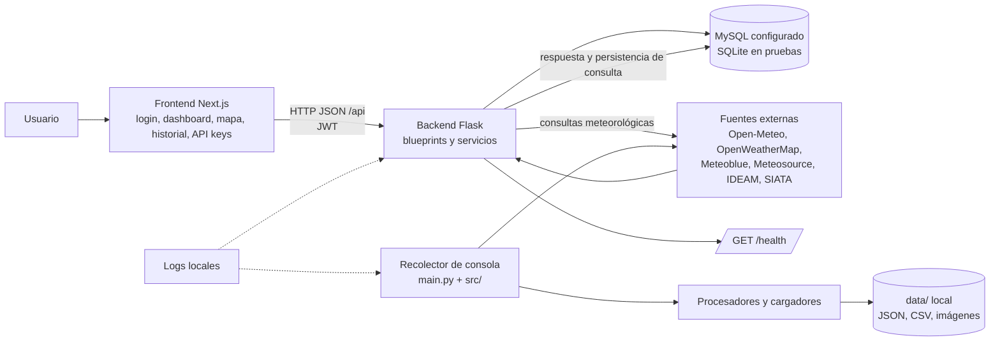
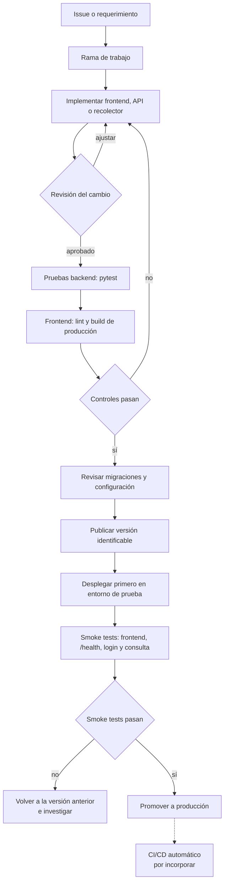
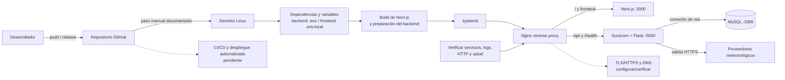
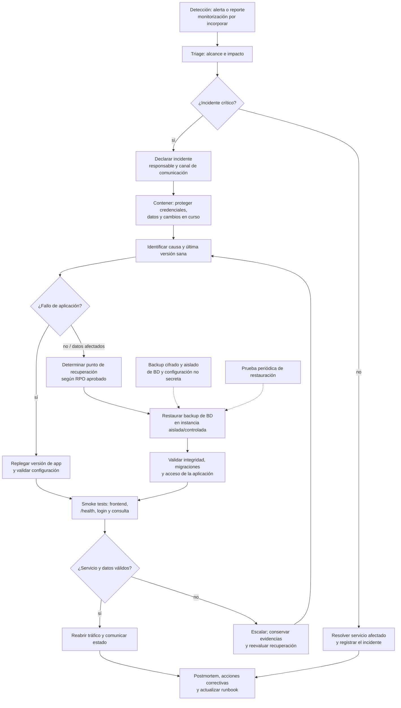

# ClimaGuru: flujo del proyecto, despliegue y continuidad

**Corte del análisis:** 4 de octubre de 2026  
**Propósito:** describir lo que existe en el repositorio y proponer una ruta operativa desde ese punto.  
**Leyenda:** `Actual/documentado` indica código o procedimiento hallado; `Por implementar/verificar` no debe interpretarse como una capacidad ya activa.

## 1. Arquitectura y flujo de datos actual

ClimaGuru contiene dos caminos relacionados, pero distintos: un recolector Python que consulta fuentes meteorológicas y guarda archivos, y una aplicación web con frontend Next.js, API Flask y base de datos. No se asume que el recolector de consola esté conectado al servicio web ni que el despliegue descrito esté actualmente activo.

### Componentes confirmados en código

- **Recolector Python:** `main.py` coordina clientes en `src/data_sources/`, procesadores en `src/processors/` y cargadores en `src/data_loaders/`; los resultados se organizan bajo `data/`.
- **Frontend:** Next.js, React y TypeScript; hay rutas de login/registro y dashboard, además de vistas de mapa, historial y administración de claves.
- **Backend:** Flask con factory `create_app`, rutas agrupadas por blueprint, servicios, modelos SQLAlchemy y autenticación JWT. `GET /health` existe.
- **Persistencia:** configuración para MySQL/MariaDB vía `DATABASE_URL` o parámetros `DB_*`; el perfil de pruebas usa SQLite en memoria. Hay migración inicial de Alembic/Flask-Migrate.
- **Pruebas:** hay pruebas backend para autenticación, consultas y servicio meteorológico. El manifiesto frontend declara build/lint, pero no un script de pruebas automatizadas.

## 2. Implementación y promoción de cambios

Flujo recomendado con controles acordes a lo que ya existe. Las pruebas y el build son ejecutables en el proyecto; automatizar su ejecución en CI está pendiente.

Antes de producción, definir quién aprueba, cómo se identifica la versión y qué migraciones pueden revertirse. Aplicar migraciones antes de poner una versión que dependa de ellas; respaldar la base de datos antes de cambios incompatibles.

## 3. Despliegue

El repositorio tiene un procedimiento en [`DESPLIEGUE_RAPIDO.md`](../DESPLIEGUE_RAPIDO.md): Ubuntu/Linux, Gunicorn y systemd para Flask, systemd para Next.js y Nginx como proxy. Esto demuestra que el despliegue está **documentado**, no que el servidor, DNS, TLS o servicios estén verificados como operativos.

### Secuencia de despliegue propuesta

1. Confirmar rama/tag a desplegar y revisar cambios de esquema.
2. En el servidor, tomar respaldo verificable de la base de datos antes de migraciones sensibles.
3. Instalar dependencias bloqueadas por `requirements.txt` y `frontend/pnpm-lock.yaml`; configurar secretos fuera del repositorio.
4. Ejecutar pruebas backend, lint/build frontend y migraciones controladas.
5. Reiniciar los servicios backend y frontend; revisar `systemctl status` y `journalctl`.
6. Verificar frontend, `/health`, autenticación y una consulta de extremo a extremo detrás de Nginx.
7. Si falla una comprobación, volver a la versión de aplicación anterior y aplicar el procedimiento de restauración de base de datos únicamente si el cambio de esquema/datos lo exige.

## 4. Continuidad operativa y recuperación

En el código/documentación examinados no se encontró una política de backup/retención, una copia externa, un procedimiento de restauración probado, monitorización/alertas ni un despliegue automatizado. Por tanto, estos son controles **pendientes**, no capacidades actuales. Definir RPO/RTO con el responsable antes de elegir frecuencias y tiempos objetivo.

### Prioridades a partir del estado actual

| Prioridad | Acción | Criterio de cierre |
|---|---|---|
| P0 | Confirmar el entorno real de producción, responsables, accesos de emergencia y dependencias externas. | Inventario operativo aprobado; documentar qué servidor/BD/dominio están realmente activos. |
| P0 | Definir RPO/RTO, frecuencia y retención; automatizar backups cifrados de MySQL y guardarlos fuera del host principal. | Backup reciente comprobable y alertas ante fallo de la tarea. |
| P0 | Probar restauración de backup en un entorno aislado y documentar recuperación de secretos/configuración desde su gestor seguro. | Evidencia de restauración y tiempos reales medidos; no guardar secretos en el repositorio ni en los backups sin protección. |
| P1 | Añadir CI para pruebas backend, lint/build frontend y revisión de migraciones en cada cambio. | Cambios no pasan a release si fallan los controles. |
| P1 | Añadir monitorización de `/health`, Nginx, procesos, espacio en disco, BD y expiración TLS; alertas con responsable. | Alertas verificadas con una prueba controlada y guía de escalamiento. |
| P1 | Estandarizar el runbook de despliegue/rollback y el nombre de servicios systemd entre las guías existentes. | Despliegue y rollback ejecutados por otra persona siguiendo solo el runbook. |
| P2 | Separar staging/producción y practicar el flujo de recuperación de aplicación y base de datos. | Simulacro periódico, hallazgos asignados y procedimiento actualizado. |

## 5. Alcance y fuentes del estado

Este diagrama se elaboró a partir del repositorio y documentación disponibles al corte indicado; no inspecciona infraestructura externa. Se contrastaron [`README.md`](../README.md), [`DESPLIEGUE_RAPIDO.md`](../DESPLIEGUE_RAPIDO.md), [`backend/README.md`](../backend/README.md), [`backend/app/__init__.py`](../backend/app/__init__.py), [`backend/app/config.py`](../backend/app/config.py), [`frontend/package.json`](../frontend/package.json) y el código bajo `src/`, `backend/` y `frontend/`.
