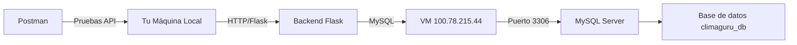

# Plan de Configuración: Conexión del Backend a MySQL en VM

## Resumen del Proyecto

Tu backend Flask ([`run.py`](climaguru-backend/run.py)) está configurado para usar SQLAlchemy con MySQL. La configuración se encuentra en [`config.py`](climaguru-backend/app/config.py) y lee las variables del archivo `.env`.

---

## Pasos para Configurar la Conexión

### Paso 1: Completar el archivo `.env` con los datos de tu VM

Edita el archivo `climaguru-backend/.env` con los siguientes valores:

```env
# Base de datos - IP de la VM
DB_HOST=100.78.215.44
DB_PORT=3306
DB_USER=TU_USUARIO_MYSQL
DB_PASSWORD=TU_PASSWORD_MYSQL
DB_NAME=TU_BASE_DE_DATOS

# Mantener el resto de valores por defecto
FLASK_ENV=development
FLASK_DEBUG=True
SECRET_KEY=tu-clave-secreta
JWT_SECRET_KEY=tu-clave-jwt
```

### Paso 2: Instalar las dependencias del proyecto

```bash
cd climaguru-backend
pip install -r requirements.txt
```

### Paso 3: Configurar MySQL en la VM para conexiones remotas

En tu máquina virtual, ejecuta estos comandos MySQL:

```sql
-- Permitir conexiones remotas
CREATE USER 'TU_USUARIO'@'%' IDENTIFIED BY 'TU_PASSWORD';
GRANT ALL PRIVILEGES ON climaguru_db.* TO 'TU_USUARIO'@'%';
FLUSH PRIVILEGES;

-- Verificar que MySQL escucha en la red
SHOW VARIABLES LIKE 'bind_address';
```

### Paso 4: Crear la base de datos en la VM

```bash
# Ejecutar el script SQL en la VM
mysql -u TU_USUARIO -p < climaguru_database.sql
```

### Paso 5: Probar la conexión desde tu máquina local

```bash
# Instalar cliente MySQL si no lo tienes
pip install pymysql

# Probar conexión desde Python
python -c "
import pymysql
conn = pymysql.connect(
    host='100.78.215.44',
    port=3306,
    user='TU_USUARIO',
    password='TU_PASSWORD',
    database='TU_BASE_DE_DATOS'
)
print('Conexión exitosa!')
conn.close()
"
```

### Paso 6: Iniciar el servidor Flask

```bash
python run.py
```

El servidor estará disponible en `http://localhost:5000`

### Paso 7: Probar con Postman

Endpoints disponibles:
- `GET /health` - Verificar que el servidor está corriendo
- `POST /api/auth/register` - Registrar un usuario
- `POST /api/auth/login` - Iniciar sesión

---

## Verificación de Conexión a Base de Datos

La configuración actual en [`config.py`](climaguru-backend/app/config.py:25) construye la URL así:

```python
SQLALCHEMY_DATABASE_URI = os.getenv(
    'DATABASE_URL',
    f'mysql+pymysql://{DB_USER}:{DB_PASSWORD}@{DB_HOST}:{DB_PORT}/{DB_NAME}'
)
```

Si `DATABASE_URL` no está definida en `.env`, usará los valores individuales.

---

## Diagrama de Arquitectura



---

## Próximos Pasos

1. **Completa el archivo `.env`** con tus credenciales de MySQL
2. **Configura el firewall de la VM** para permitir conexiones al puerto 3306
3. **Ejecuta el script SQL** en la VM
4. **Inicia el servidor** y verifica la conexión
5. **Prueba con Postman** los endpoints de autenticación

---

## Endpoints API para Probar con Postman

| Método | Endpoint | Descripción |
|--------|----------|-------------|
| GET | `/health` | Verificar estado del servidor |
| POST | `/api/auth/register` | Registrar nuevo usuario |
| POST | `/api/auth/login` | Iniciar sesión |
| GET | `/api/usuarios/<id>` | Obtener usuario por ID |
| POST | `/api/api-keys` | Crear API key |
| POST | `/api/consultas` | Realizar consulta de clima |
| GET | `/api/datos` | Obtener datos climáticos |
